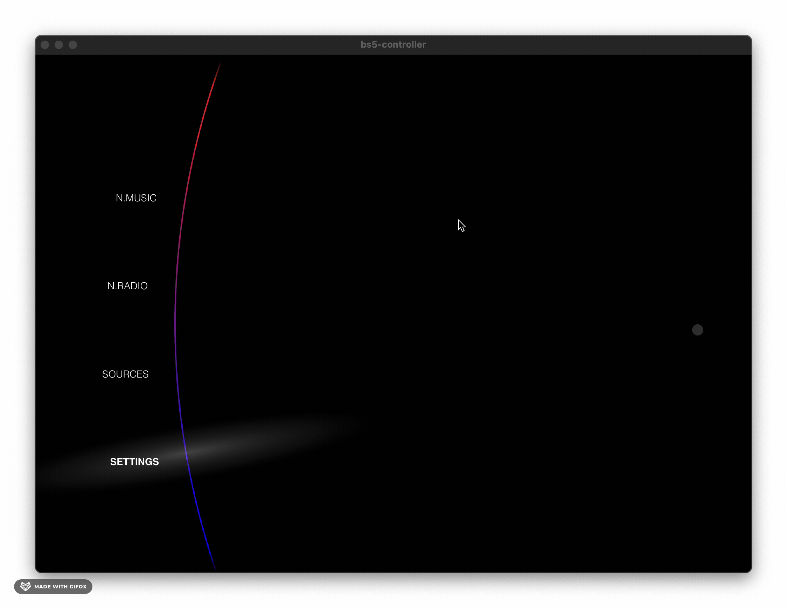
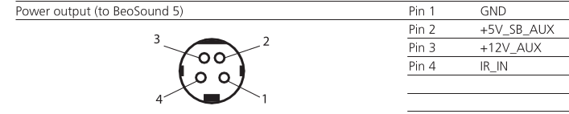

[](https://crates.io/crates/beolyd5_controller)


```ascii
   ____             _           _ _____                          
  |  _ \           | |         | | ____|                         
  | |_) | ___  ___ | |_   _  __| | |__                           
  |  _ < / _ \/ _ \| | | | |/ _` |___ \                          
  | |_) |  __/ (_) | | |_| | (_| |___) |                         
  |____/ \___|\___/|_|\__, |\__,_|____/                          
                       __/ |                                     
                      |___/                                ┌───────┐
                                                         ┌─┴─────┐ │
  ┌─────────────┐               ┌─────────┐              │ .───. │)│
  │            .┴.              │  Pi 5/  │              │(     )│ │
  │   BS5     ( = )◀──USB+HDMI──│HifiBerry│◀──PowerLink──│ `───' │ │
  │            `┬'              │         │              │BeoLab ├─┘
  └─────────────┘               └─────────┘              └───────┘  
```

# Beolyd5

> [!TIP]
> Try the new [online device simulator](https://larsbaunwall.github.io/Beolyd5/#/sim) just launched. Follow the progress as the UI matures :sparkles:

Back in the day, I absolutely adored the [BeoSound 5](https://beo.zone/en/beosound-5), which I thought was a very beautifully designed item for the home - alongside being a sound system.

Unfortunately, Bang & Olufsen made a number of unfortunate choices, not preparing the product for future software updates. This has left the Windows XP-based system in the past, unable to provide modern streaming services or the like.

This project aims to bring new life into this device, with modern hardware and an open source platform to drive it.

This will eventually become an alternative product experience for the Beosound 5 controller.

And the project name? Well, "sound" is "lyd" in danish ;-)

This is a very early version of the [new UI](src/ui):



## Plans

### The hardware

The rotary controller protocol over USB has been reverse engineered and implemented in
`src/rust` as the `beolyd5_controller` crate. Alternatively, a linux kernel module that exports 
the HID events into "good" ones (joysting with axis, buttons, etc) is available 
at 
[beosound5-kernel-module](https://github.com/Frankkkkk/beosound5-kernel-module).


This work is greatly inspired and informed by 
[@toresby](https://github.com/toresbe)'s work on 
[neomaster](https://github.com/toresbe/neomaster).

I am also looking into new hardware to replace the old Beomaster5, which I plan to replace with a Raspberry Pi with the [Hifiberry DAC2 HD](https://www.hifiberry.com/shop/boards/hifiberry-dac2-hd/) for audio.

#### Beosound 5 power connection

The pinout for the mini-DIN 4 power connection is (view from port):


Please note that mini-HDMI and USB need to be plugged in for the screen to power 
on.
The beosound 5 does not export EDID information, so the screen caracteristics 
need to be set beforehand. For unknown reasons, it works out of box on 
RaspberryPis.

### The software

I plan to build and extend the [HifiberryOS (Beocreate) platform](https://www.hifiberry.com/hifiberryos/) with a custom local UI that can be operated with the rotary dial on the Beosystem 5 control unit.

Hifiberry in itself will bring support for

* Airplay
* Analoge input of the DAC+ ADC
* Bluetooth (not on Raspberry Pi 3B)
* DLNA
* Logitech Media Server / Squeezebox
* MPD for local music
* Snapcast (experimental)
* Spotify
* Roon
* Web radio stations

The application consists of two parts:

1. a [Rust-based HW abstraction](src/rust) that interfaces with the BS5 controller. This library understands the BS5 controller protocol over USB and is also available on [crates.io](https://crates.io/crates/beolyd5_controller)
2. a [Tauri](https://tauri.app/)-based application that hosts a [VueJS-frontend](src/ui/src) using a platform-specific renderer (Webkit2GTK on Linux). This application mimicks the original interface found on the Beosund 5.

## Contributing

This is a hobby project of mine.  I don't know when I will be done or how it will look.

I am not a UI designer, so I could use some help in that department. Likewise, I am still a beginner in the embedded world, so defintately would appreciate a helping hand there as well.

Just start a discussion or create an issue then I'll get back to you.
