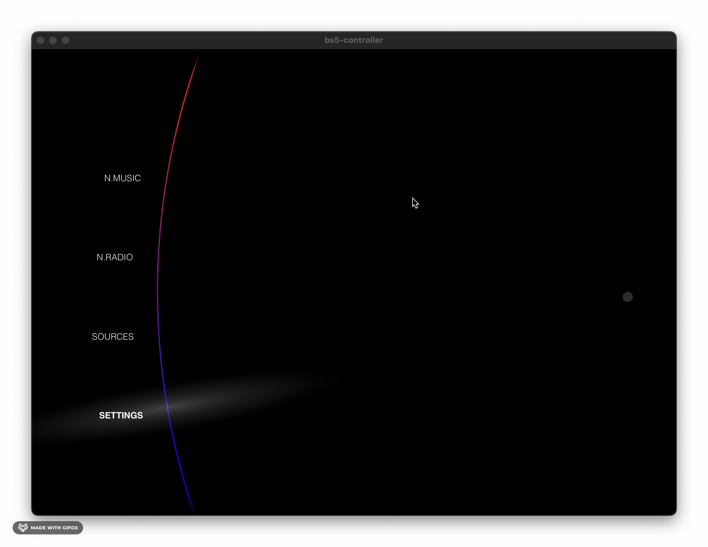

# Beosund 5 UI

This is the controller software for the Beolyd5 project, mimicking the original Beosound5 interface.

The project is composed of a VueJS frontend running on a Rust-based Chrome/Webkit host ([Tauri](https://www.tauri.org)). It's kinda like Electron, just much more performant.

You can see an early snapshot of the UI so far here:

## Run it

Running it locally is easy:

Clone this repo and run `npm tauri dev` in the bs5-contoller directory.

## Hardware

The interface will be running on an embedded Linux (Raspberry PI) connected to the Beosound 5 controller via HDMI and USB.